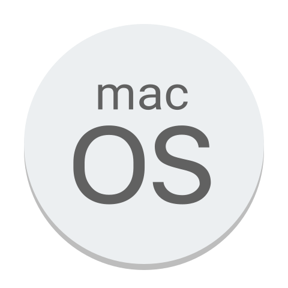

<h1 align="center">Hi, I'm Guilherme 👋</h1>

 

  
  <ul align="left">
    <li>🌱 I'm a Full Stack Developer and also Chemical and Quality Engineer.</li>
     
    <li>❤️ I'm in love with back-end and I’m currently learning Node.js, Typescript, MongoDB and Python.</li>
     
    <li>⭐️ Fun fact about me: I'm a nintendo lover, compulsive reader (when I have time) and also I'm always trying to take cool pictures.</li>
     
    <li>
      ✉️ You can also reach me at 
      <a href="mailto:gfengquimica@gmail.com" target="_blank">gfengquimica@gmail.com</a> 
      or add me on 
      <a href="https://www.linkedin.com/in/guilherme-ac-fernandes/" target="_blank">
      LinkedIn</a>.
  </ul>

 

  
<strong>PT-BR 🇧🇷</strong>
 
  <h3 align="center">Oi, eu sou o Guilherme 👋</h3>
  <ul>
    <li>🌱 Eu sou Desenvolvedor Full Stack e também Engenheiro Químico e da Qualidade.</li>
     
    <li>❤️ Estou apaixonado por back-end e estou aprendendo Node.js, Typescript, MongoDB e Python.</li>
     
    <li>⭐️ Fato divertido sobre mim: sou Nintendista, leitor compulsivo (quando tenho tempo) e também estou sempre tentando tirar fotos legais.</li>
     
    <li>
      ✉️ Você pode entrar em contato comigo pelo
      <a href="mailto:gfengquimica@gmail.com" target="_blank">gfengquimica@gmail.com</a> 
      ou me adicionar no 
      <a href="https://www.linkedin.com/in/guilherme-ac-fernandes/" target="_blank">
      LinkedIn</a>.
  </ul>

 

<h2 align="center">Technologies and Tools 💻</h2>
<table align="center">
  <tr>
    <th>Languages & Tools</th>
    <th>Front-End</th> 
    <th>Back-End</th>
  </tr>
  <tr align="center">
    <td display="flex">
      
      
      
      
      
      
      
    </td>
    <td align="center">
      
      
      
      
      
      
    </td> 
    <td align="center">
      
      
    
      
      
      
      
    </td>
  </tr>
</table>

 
 

<h2 align="center">Projects 👨🏻‍💻</h2>
<table>
  <tr>
    <td valign="top">
      <h3 align="center">Harry Potter - FullStack</h3>
      

        <a href="https://github.com/guilherme-ac-fernandes/harrypotter-fullstack">Code</a>
      

      
React, Node.js and MySQL

      
    </td>
    <td valign="top">
      <h3 align="center">Trivia</h3>
      

        <a href="https://github.com/guilherme-ac-fernandes/trivia">Code</a>
         - 
        <a href="https://trivia-pink.vercel.app/">Link</a>
      

      
React, Redux and CSS

      
    </td>
    <td valign="top">
      <h3 align="center">Blogs API</h3>
      

        <a href="https://github.com/guilherme-ac-fernandes/blogs-api">Code</a>
      

      
Node.js, Sequelize and MySQL

      
    </td>
    
  </tr>
  <tr>
    <td valign="top">
      <h3 align="center">Trybe Football Club</h3>
      

        <a href="https://github.com/guilherme-ac-fernandes/trybe-futebol-clube">Code</a>
      

      
Node.js, Typescript and MySQL

      
    </td>
    <td valign="top">
      <h3 align="center">Job Insights</h3>
      

        <a href="https://github.com/guilherme-ac-fernandes/job-insights">Code</a>
      

      
Python and Flask

      
    </td>
    <td valign="top">
      <h3 align="center">Star Wars Planet Search</h3>
      

        <a href="https://github.com/guilherme-ac-fernandes/starwars-planets-search">Code</a>
         - 
        <a href="https://starwars-planets-search-alpha.vercel.app/">Link</a>
      

      
React, Hooks and CSS

      
    </td>
    
  </tr>
  <tr>
    <td valign="top">
      <h3 align="center">Store Manager</h3>
      

        <a href="https://github.com/guilherme-ac-fernandes/store-manager">Code</a>
      

      
Node.js, MySQL and Tests

      
    </td>
    <td valign="top">
      <h3 align="center">eSport</h3>
      

        <a href="https://github.com/guilherme-ac-fernandes/nlw-esports-ignite">Code</a>
      

      
React, Node.js and React-Native

      
    </td>
    <td valign="top">
      <h3 align="center">Car Shop</h3>
      

        <a href="https://github.com/guilherme-ac-fernandes/car-shop">Code</a>
      

      
Node.js, Typescript and MongoDB

      
    </td>
    
  </tr>
</table>

 
 

<h2 align="center">Github Stats 📊</h2> 

  

 

<!--  -->
